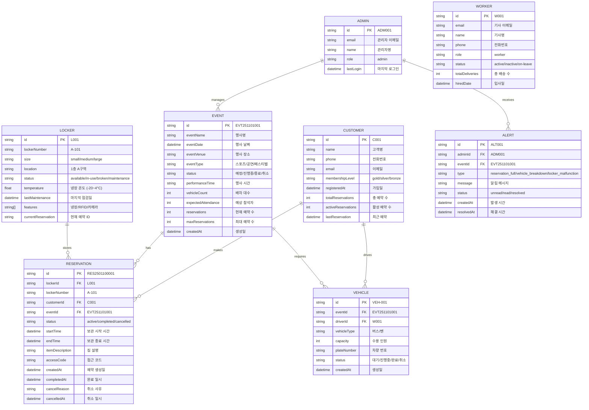

# GigStash 데이터베이스 ERD (Entity Relationship Diagram)

## 개요
GigStash는 행사/이벤트 참석자의 짐 보관을 관리하는 스토리지 라커 시스템입니다.
주요 엔티티 간의 관계와 데이터 흐름을 나타냅니다.

---

## ERD 다이어그램 (Mermaid 형식)



---

## 엔티티별 상세 설명

### 1. CUSTOMER (고객)
**역할**: 행사 참석자 (예약자)

| 필드 | 타입 | 설명 | 예시 |
|------|------|------|------|
| id | string | 고객 ID (PK) | C001 |
| name | string | 고객명 | 김철수 |
| phone | string | 전화번호 | 010-1234-5678 |
| email | string | 이메일 | kim.cs@email.com |
| membershipLevel | enum | 멤버십 등급 | gold/silver/bronze |
| registeredAt | datetime | 가입 날짜 | 2024-11-15T10:00:00Z |
| totalReservations | int | 총 예약 수 | 15 |
| activeReservations | int | 활성 예약 수 | 1 |
| lastReservation | datetime | 최근 예약 일시 | 2025-01-09T15:30:00Z |

**비즈니스 규칙**:
- 고객은 여러 행사에 참석할 수 있음
- 멤버십 등급에 따라 할인 적용 가능
- 동일 번호로 중복 가입 방지

---

### 2. EVENT (행사)
**역할**: 개최되는 행사/이벤트 정보

| 필드 | 타입 | 설명 | 예시 |
|------|------|------|------|
| id | string | 행사 ID (PK) | EVT251101001 |
| eventName | string | 행사명 | 프로농구 삼성 vs KCC |
| eventDate | date | 행사 날짜 | 2025-11-01 |
| eventVenue | string | 행사 장소 | 잠실실내체육관 |
| eventType | enum | 행사 유형 | 스포츠/공연/페스티벌 |
| status | enum | 행사 상태 | 예정/진행중/종료/취소 |
| performanceTime | time | 행사 시간 | 14:00 |
| vehicleCount | int | 배차된 차량 수 | 2 |
| expectedAttendance | int | 예상 참석자 | 90 |
| **reservations** | int | **현재 예약 수** | **45** |
| **maxReservations** | int | **최대 예약 수 (NEW)** | **50** |
| createdAt | datetime | 생성 날짜 | 2025-10-20T09:00:00Z |

**추가 필드 (NEW)**:
- `maxReservations`: vehicleCount * 25 (1 차량당 약 25명)
  - 예: vehicleCount=2 → maxReservations=50

**비즈니스 규칙**:
- 행사는 최대 예약 수만큼만 예약 가능
- 예약이 꽉 차면 관리자에게 알람 발송
- 행사 상태가 종료되면 모든 예약 자동 완료

---

### 3. RESERVATION (예약)
**역할**: 고객의 짐 보관 예약

| 필드 | 타입 | 설명 | 예시 |
|------|------|------|------|
| id | string | 예약 ID (PK) | RES2501100001 |
| lockerId | string | 보관함 ID (FK) | L001 |
| lockerNumber | string | 보관함 번호 | A-101 |
| customerId | string | 고객 ID (FK) | C001 |
| eventId | string | 행사 ID (FK) | EVT251101001 |
| status | enum | 예약 상태 | active/completed/cancelled |
| startTime | datetime | 보관 시작 시간 | 2025-11-01T09:00:00Z |
| endTime | datetime | 보관 종료 시간 | 2025-11-01T18:00:00Z |
| itemDescription | string | 짐 설명 | 도시락, 음료 |
| accessCode | string | 접근 코드 (숫자) | 1234 |
| createdAt | datetime | 예약 생성일 | 2025-10-30T15:30:00Z |
| completedAt | datetime | 완료 일시 | 2025-11-01T18:05:00Z |
| cancelReason | string | 취소 사유 | 고객 요청 |
| cancelledAt | datetime | 취소 일시 | 2025-10-31T10:00:00Z |

**비즈니스 규칙**:
- 예약은 행사의 maxReservations를 초과할 수 없음
- 예약 생성 시 자동으로 빈 보관함 할당
- 행사 상태와 동기화 (종료 → 자동 완료)

---

### 4. LOCKER (보관함)
**역할**: 실제 짐 보관 공간

| 필드 | 타입 | 설명 | 예시 |
|------|------|------|------|
| id | string | 보관함 ID (PK) | L001 |
| lockerNumber | string | 보관함 번호 | A-101 |
| size | enum | 크기 | small/medium/large |
| location | string | 위치 | 1층 A구역 |
| status | enum | 상태 | available/in-use/broken/maintenance |
| temperature | float | 냉장 온도 | -5.2 (선택사항) |
| lastMaintenance | datetime | 마지막 점검일 | 2025-01-05T10:00:00Z |
| features | string[] | 특징 | ["냉장", "RFID", "카메라"] |
| currentReservation | string | 현재 예약 ID | RES2501100001 |

**비즈니스 규칙**:
- 상태 변경: available → in-use → available/broken
- 냉장 보관함만 temperature 필드 사용
- 고장 보관함은 예약 할당 불가

---

### 5. VEHICLE (차량)
**역할**: 행사 배송용 차량 관리

| 필드 | 타입 | 설명 | 예시 |
|------|------|------|------|
| id | string | 차량 ID (PK) | VEH-001 |
| eventId | string | 행사 ID (FK) | EVT251101001 |
| driverId | string | 기사 ID (FK) | W001 |
| vehicleType | enum | 차종 | 버스/밴/트럭 |
| capacity | int | 수용 인원 | 50 |
| plateNumber | string | 차량 번호 | 서울01가1234 |
| status | enum | 상태 | 대기/진행중/완료/취소 |
| createdAt | datetime | 생성일 | 2025-10-20T09:00:00Z |

**비즈니스 규칙**:
- 1 행사 = 여러 차량
- vehicleCount = 배차된 차량 수
- capacity로 maxReservations 결정 가능

---

### 6. ADMIN (관리자)
**역할**: 시스템 관리자

| 필드 | 타입 | 설명 | 예시 |
|------|------|------|------|
| id | string | 관리자 ID (PK) | ADM001 |
| email | string | 이메일 | admin@gigstash.com |
| name | string | 관리자명 | 홍길동 |
| role | enum | 역할 | admin |
| lastLogin | datetime | 마지막 로그인 | 2025-01-10T09:30:00Z |

---

### 7. ALERT (알림) - NEW
**역할**: 시스템 알림 관리 (NEW)

| 필드 | 타입 | 설명 | 예시 |
|------|------|------|------|
| id | string | 알림 ID (PK) | ALT001 |
| adminId | string | 관리자 ID (FK) | ADM001 |
| eventId | string | 행사 ID (FK) | EVT251101001 |
| type | enum | 알림 유형 | reservation_full / vehicle_breakdown / locker_malfunction / capacity_warning |
| message | string | 알림 메시지 | "EVT251101001의 예약이 가득 찼습니다" |
| status | enum | 상태 | unread / read / resolved |
| severity | enum | 심각도 | low / medium / high / critical |
| createdAt | datetime | 발생 시간 | 2025-01-10T14:30:00Z |
| resolvedAt | datetime | 해결 시간 | 2025-01-10T15:00:00Z |

**알림 유형**:
1. `reservation_full`: 예약이 최대치에 도달
2. `vehicle_breakdown`: 차량 고장
3. `locker_malfunction`: 보관함 고장
4. `capacity_warning`: 예약 가능 용량 70% 도달

---

### 8. WORKER (기사) - 기존
**역할**: 배송 및 보관함 관리 담당자

| 필드 | 타입 | 설명 | 예시 |
|------|------|------|------|
| id | string | 기사 ID (PK) | W001 |
| email | string | 이메일 | driver@gigstash.com |
| name | string | 기사명 | 이순신 |
| phone | string | 전화번호 | 010-9876-5432 |
| role | enum | 역할 | worker |
| status | enum | 상태 | active/inactive/on-leave |
| totalDeliveries | int | 총 배송 수 | 156 |
| hiredDate | datetime | 입사일 | 2024-08-15T00:00:00Z |

---

## 관계도 (Relationship)

### 1:N 관계

```
CUSTOMER (1) ------ (N) RESERVATION
  └─ 하나의 고객은 여러 행사에서 예약 가능

EVENT (1) ------ (N) RESERVATION
  └─ 하나의 행사는 여러 고객의 예약을 수용

EVENT (1) ------ (N) VEHICLE
  └─ 하나의 행사에 여러 차량 배차

LOCKER (1) ------ (N) RESERVATION
  └─ 하나의 보관함에 여러 예약 순차 처리

ADMIN (1) ------ (N) ALERT
  └─ 하나의 관리자가 여러 알림 수신

VEHICLE (1) ------ (N) DRIVER
  └─ 하나의 차량에 한 명의 기사 배정 (N:1)
```

### 중요 관계

```
CUSTOMER → VEHICLE (간접)
  └─ CUSTOMER가 탑승한 VEHICLE 조회

EVENT → ALERT (간접)
  └─ 행사 관련 알림 조회
```

---

## 데이터 흐름

### 행사 생성부터 예약 완료까지

```
1. EVENT 생성
   ├─ id: EVT251101001
   ├─ vehicleCount: 2
   └─ maxReservations: 50 (자동 계산)

2. VEHICLE 배차 (vehicleCount만큼)
   ├─ VEH-001 (버스, capacity=50)
   └─ VEH-002 (버스, capacity=50)

3. CUSTOMER가 RESERVATION 생성
   ├─ customerId: C001
   ├─ eventId: EVT251101001
   ├─ 자동으로 available LOCKER 할당
   └─ status: active

4. EVENT reservations 카운트 증가
   ├─ reservations: 1 → 2 → ... → 50
   └─ 50에 도달하면 ALERT 발송

5. EVENT 상태 종료로 변경 (eventDate 경과)
   ├─ status: 진행중 → 종료
   └─ 모든 active RESERVATION → completed

6. ADMIN이 ALERT 확인 및 해결
   ├─ status: unread → read → resolved
   └─ resolvedAt 기록
```

---

## SQL 스키마 (참고)

```sql
-- CUSTOMER
CREATE TABLE customers (
  id VARCHAR(10) PRIMARY KEY,
  name VARCHAR(50) NOT NULL,
  phone VARCHAR(20) UNIQUE,
  email VARCHAR(100) UNIQUE,
  membershipLevel ENUM('gold', 'silver', 'bronze'),
  registeredAt TIMESTAMP DEFAULT CURRENT_TIMESTAMP,
  totalReservations INT DEFAULT 0,
  activeReservations INT DEFAULT 0,
  lastReservation TIMESTAMP
);

-- EVENT
CREATE TABLE events (
  id VARCHAR(20) PRIMARY KEY,
  eventName VARCHAR(200) NOT NULL,
  eventDate DATE NOT NULL,
  eventVenue VARCHAR(200),
  eventType VARCHAR(50),
  status ENUM('예정', '진행중', '종료', '취소'),
  performanceTime TIME,
  vehicleCount INT,
  expectedAttendance INT,
  reservations INT DEFAULT 0,
  maxReservations INT,
  createdAt TIMESTAMP DEFAULT CURRENT_TIMESTAMP,
  UNIQUE KEY unique_event_date (eventName, eventDate)
);

-- RESERVATION
CREATE TABLE reservations (
  id VARCHAR(20) PRIMARY KEY,
  lockerId VARCHAR(10) NOT NULL,
  lockerNumber VARCHAR(10),
  customerId VARCHAR(10) NOT NULL,
  eventId VARCHAR(20) NOT NULL,
  status ENUM('active', 'completed', 'cancelled'),
  startTime TIMESTAMP,
  endTime TIMESTAMP,
  itemDescription TEXT,
  accessCode VARCHAR(10),
  createdAt TIMESTAMP DEFAULT CURRENT_TIMESTAMP,
  completedAt TIMESTAMP,
  cancelReason VARCHAR(100),
  cancelledAt TIMESTAMP,
  FOREIGN KEY (lockerId) REFERENCES lockers(id),
  FOREIGN KEY (customerId) REFERENCES customers(id),
  FOREIGN KEY (eventId) REFERENCES events(id)
);

-- LOCKER
CREATE TABLE lockers (
  id VARCHAR(10) PRIMARY KEY,
  lockerNumber VARCHAR(10) UNIQUE NOT NULL,
  size ENUM('small', 'medium', 'large'),
  location VARCHAR(100),
  status ENUM('available', 'in-use', 'broken', 'maintenance'),
  temperature DECIMAL(5,2),
  lastMaintenance TIMESTAMP,
  features JSON,
  currentReservation VARCHAR(20),
  FOREIGN KEY (currentReservation) REFERENCES reservations(id)
);

-- VEHICLE
CREATE TABLE vehicles (
  id VARCHAR(20) PRIMARY KEY,
  eventId VARCHAR(20) NOT NULL,
  driverId VARCHAR(10),
  vehicleType VARCHAR(50),
  capacity INT,
  plateNumber VARCHAR(20),
  status VARCHAR(50),
  createdAt TIMESTAMP DEFAULT CURRENT_TIMESTAMP,
  FOREIGN KEY (eventId) REFERENCES events(id),
  FOREIGN KEY (driverId) REFERENCES workers(id)
);

-- ALERT (NEW)
CREATE TABLE alerts (
  id VARCHAR(20) PRIMARY KEY,
  adminId VARCHAR(10) NOT NULL,
  eventId VARCHAR(20),
  type VARCHAR(50),
  message TEXT,
  status ENUM('unread', 'read', 'resolved'),
  severity ENUM('low', 'medium', 'high', 'critical'),
  createdAt TIMESTAMP DEFAULT CURRENT_TIMESTAMP,
  resolvedAt TIMESTAMP,
  FOREIGN KEY (adminId) REFERENCES admins(id),
  FOREIGN KEY (eventId) REFERENCES events(id)
);

-- ADMIN
CREATE TABLE admins (
  id VARCHAR(10) PRIMARY KEY,
  email VARCHAR(100) UNIQUE NOT NULL,
  name VARCHAR(50),
  role VARCHAR(20),
  lastLogin TIMESTAMP
);

-- WORKER
CREATE TABLE workers (
  id VARCHAR(10) PRIMARY KEY,
  email VARCHAR(100) UNIQUE NOT NULL,
  name VARCHAR(50),
  phone VARCHAR(20),
  role VARCHAR(20),
  status VARCHAR(50),
  totalDeliveries INT DEFAULT 0,
  hiredDate TIMESTAMP
);
```

---

## 인덱스 및 성능 최적화

```sql
-- 자주 조회되는 필드 인덱스
CREATE INDEX idx_reservation_eventid ON reservations(eventId);
CREATE INDEX idx_reservation_customerid ON reservations(customerId);
CREATE INDEX idx_reservation_status ON reservations(status);
CREATE INDEX idx_event_date ON events(eventDate);
CREATE INDEX idx_alert_adminid ON alerts(adminId);
CREATE INDEX idx_alert_status ON alerts(status);

-- 복합 인덱스 (쿼리 성능 향상)
CREATE INDEX idx_res_event_status ON reservations(eventId, status);
CREATE INDEX idx_alert_admin_status ON alerts(adminId, status);
```

---

## 정규화 분석 (Normalization)

### 1NF (제1 정규형)
- ✅ 모든 속성이 원자값 (Atomic Value)
- ⚠️ LOCKER.features는 JSON 배열 (비정규형, 유연성을 위해 선택)

### 2NF (제2 정규형)
- ✅ 부분 함수 종속 제거됨

### 3NF (제3 정규형)
- ✅ 이행 함수 종속 제거됨

### 비정규화 (반정규화, Denormalization)
- `EVENT.reservations`: 성능 향상을 위해 역정규화
  - 예약 생성/취소 시마다 업데이트
  - 알림 발송 시 이 필드로 빠른 조회 가능

---

## 데이터 일관성 (Data Integrity)

### 제약 조건 (Constraints)

```javascript
// Event와 Reservation 동기화
if (event.reservations >= event.maxReservations) {
  sendAlert({
    type: 'reservation_full',
    message: `${event.eventName}의 예약이 가득 찼습니다.`,
    severity: 'high'
  });
}

// Event 상태 변경 시 Reservation 자동 업데이트
if (event.status === '종료') {
  reservations
    .filter(r => r.eventId === event.id && r.status === 'active')
    .forEach(r => r.status = 'completed');
}

// Locker 상태 확인
if (locker.status === 'broken' || locker.status === 'maintenance') {
  // 예약 할당 불가
}
```

---

## 확장성 고려사항

### 향후 추가될 수 있는 엔티티

1. **PAYMENT** (결제): 예약료 결제 관리
2. **REVIEW** (리뷰): 고객 만족도 피드백
3. **PROMOTION** (프로모션): 할인/쿠폰 관리
4. **REFUND_REQUEST** (환불): 환불 요청 추적
5. **MAINTENANCE_LOG** (점검 기록): 보관함 점검 이력

---

## 요약

**GigStash ERD는 다음을 강조합니다:**

1. **명확한 주요 엔티티**: EVENT → RESERVATION ← LOCKER/CUSTOMER
2. **알림 시스템**: ALERT로 관리자의 실시간 모니터링 지원
3. **용량 관리**: EVENT.maxReservations로 예약 한계 설정
4. **상태 추적**: 모든 엔티티의 상태 변경 기록
5. **확장성**: 향후 결제, 리뷰 등 추가 시스템 통합 가능

이 구조는 **중소 규모 행사 예약 관리 시스템**에서 **대규모 다중 행사 관리 플랫폼**으로 확장할 수 있도록 설계되었습니다.
